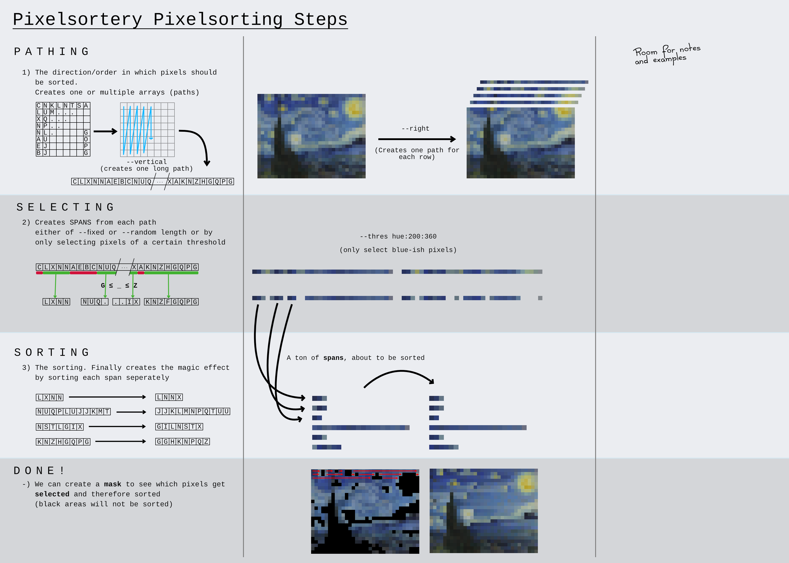

# Pixelsortery - A Pixelsorter App written in Rust!

Inspired by [ASDFPixelSort](https://github.com/kimasendorf/ASDFPixelSort) by [Kim Asendorf](https://kimasendorf.com/)!
I've written a few Pixelsorters before:
- My first one originated from modifying the original processing code until it became a little Java Swing Application: [Pixel-Sorter-App](https://github.com/Lxtharia/pixel-sorter-app).
- My second implementation was in C. It may or may not have been faster and the code was a mess, but it was usable from the command line!
- But now I have engineered THIS pixelsorter with _far greater goals_, created as a rust practice project but striving to be BEST and FASTEST FOSS-Pixelsorter of them all (maybe)!!!

## Showcase
// TODO

## Installation

Download the binaries from the Releases page [here](https://github.com/Lxtharia/pixelsortery/releases)

Or alternativly build it from source

### Building from source
Prerequisites: You need to have rust and cargo (rusts package manager) installed
Then run this on the command line
```bash
git clone https://github.com/Lxtharia/pixelsortery
cd pixelsortery-rs
cargo install
```

## Usage (CLI)
```bash
# The --help output is more up-to-date than this README and nicely formatted
pixelsortery --help
# Usage example
pixelsortery -i input.png -o output.png --right --random 200 --mapsort 
```

1. Read the explanation below
2. Read the `--help` output
3. Experiment with it!

## Usage (GUI)
To start the gui double click it or execute the binary without arguments.

You can also pass the --gui flag to apply other command line options when opening the GUI.

## Explanation (How it works)

This is a very MODULAR sorter.
There are multiple stages to allow for easy (future) customization:

1. **Creating Paths**
    - Usually determines the sorting direction, but can be much more
    - Defines the order in which pixels are processed
    - Allows to sort in horizontal or vertical lines
    - Allows to sort in different shapes like spirals
    - Allows to sort in a space filling fractal, the [hilbert curve](https://en.wikipedia.org/wiki/Hilbert_curve)
        - Gilbert algorithm taken from [jakubcerveny](https://github.com/jakubcerveny/gilbert)
2. **Selecting**
    - The magic behind the cool pixelsort-effect: we only sort _intervals_ of pixels (calling them spans)
    - We are iterating pixels in whatever order the iteration has yielded to us
    - We select these intervals by grouping similar pixels together
    - Examples:
        - Group (select) bright pixels (pixels with their brightness value between 180 and 255)
        - Select blue pixels (pixels with their hue value between 190 and 240)
    - All other pixels, not fulfilling this requirement, will not get sorted
    - We only group pixels that come after each other, so (D, B, B, D, D, B, D) gives us the spans (B, B) and (B) 
        - With B being bright and D being dark, following the previous example
3. **Sorting**
    - Finally, sorting
    - Can sort by different criteria
    - Brightness looks the most smooth
    - Also allows to change the sorting algorithm, which can create different results (see [Sorting algorithm stability](https://en.wikipedia.org/wiki/Sorting_algorithm#Stability))

<details>
<summary>
<h3> ~=~=~=~=~= A COOL CHART, CLICK HERE, LOOK AT IT =~=~=~=~=~ </h3>
</summary>


it will get better hopefully, maybe, eventually

</details>

## Features

- [x] Choose to sort lines in all 4 directions
- [x] Sort pixels _diagonally_, in rectangular shape, in circles, 
- [x] Sort pixels in the shape of the space filling hilbert curve (very sweet)
- [x] Choose to select spans of random or fixed length
- [x] Choose to select spans based on their hue/brightness/saturation
- [x] Sorts pixel with MAPSORT (HELL YEAH!!)
- [x] Also allows to use a COMPLETELY BROKEN sorting algorithm, creating a super rad glitch effect (try out)
- [x] A super cool CLI interface!
- [x] Read input from stdin and write to stdout, allowing easy chaining
- [x] a GUI (holy damn)
- [x] a really good GUI (damn holy)
- [x] Sort _multiple_ times with layers

## Planned Features

- [ ] a godlike GUI where you can edit masks in real time (holy mother in heaven)
- [ ] Add more pattern patterns to sort by (sin waves, star shape, ...)
- [ ] Allow to read custom pathing data from file
- [ ] Allow to use MASKS to control which areas should be sorted and which shouldn't
- [ ] Allow to logically combine selectors (sort pixels that are bright _and_ red)
- [ ] Built-in animation (low prio)

## Cool!

If you like this software, consider buying me a coffee!

<a href="https://www.buymeacoffee.com/latharia" target="_blank"></a>

## Yeah
yeah
```
Yeah!!
```
> yeah

| yeah |
| ---- |
| _yeah_ |
